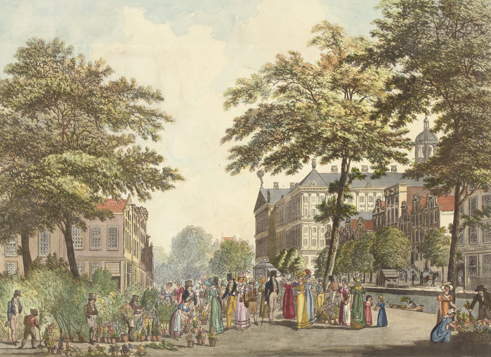
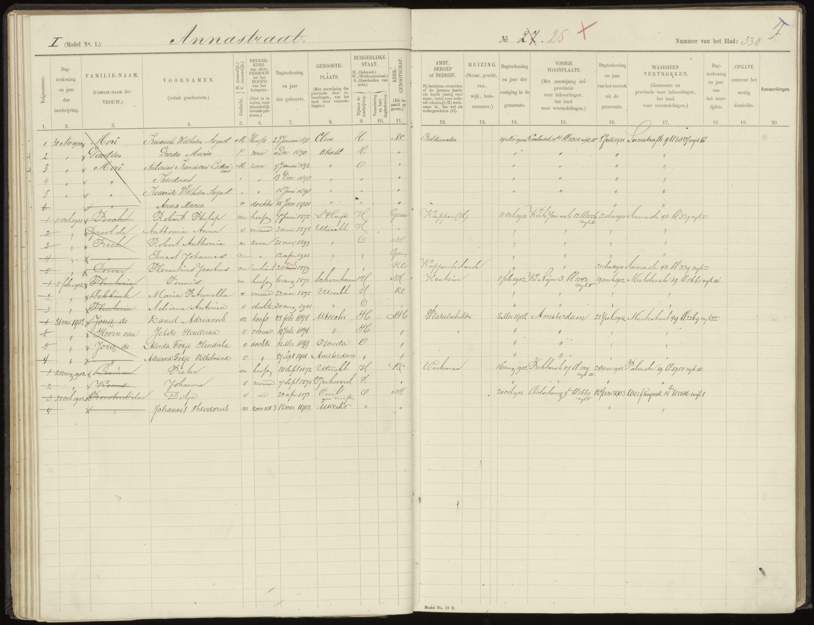
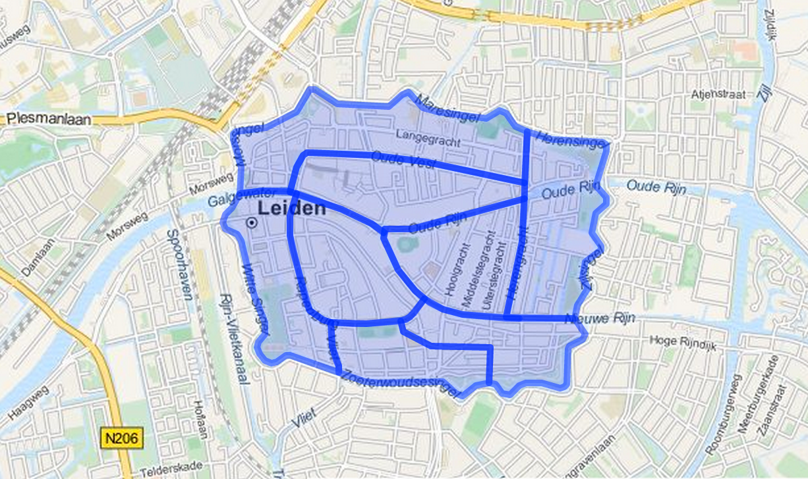
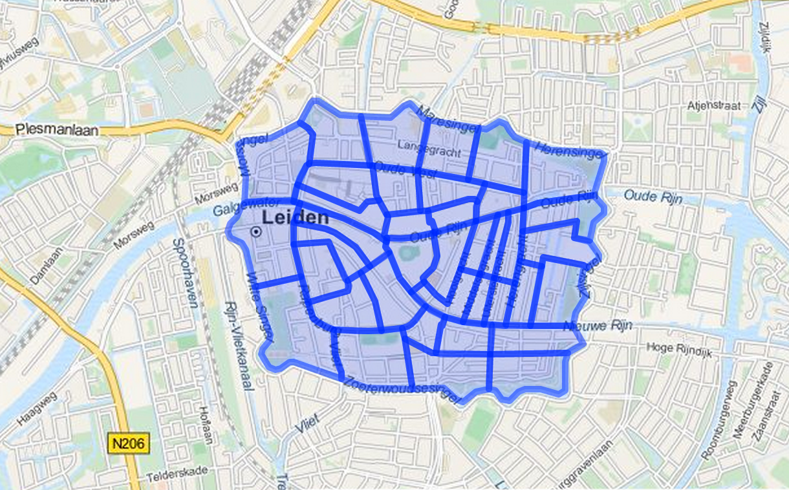

Een aantal dataclinics in augustus, waar zowel erfgoedinstellingen als ontwikkelaars van de Geocoder aanwezig waren, heeft goed in beeld gebracht hoe de geocoder in de praktijk gebruikt kan gaan worden. Gebouwen en adressen spelen een belangrijke rol.

De afgelopen zomer is hard gewerkt aan een verbeterde versie van de geocoder. De api is robuuster, geeft nu relaties weer met andere Pits (Plaatsen in Tijd) en PiTs kunnen nu 'fuzzy' dateringen hebben - bijvoorbeeld een begindatum tussen 1800 en 1810 en een einddatum tussen 4 oktober en 14 oktober 1921. Ook kunnen we nu relaties leggen met URIs elders op het web zonder die objecten zelf op te slaan - 'linked data' zoals het bedoeld is.

Tijdens de eerste dataclinic - in het Rijksmuseum - was de nieuwe versie nog niet beschikbaar en moesten we ons beperken tot het bespreken van api, standaardiseertool en wat het museum daar mee wil. Kort door de bocht is dat vooral het toevoegen van coördinaten aan plaatsen in de eigen thesaurus. De standaardiseertool zien ze daarbij als zeer nuttig instrument, en de ontwikkelaars kregen een aantal goede suggesties voor de volgende versie.

Interessant was dat een flink aantal plaatsen in de collectiebeschrijving van het museum gebouwen betreft - het 'koninklijk paleis' hierboven bijvoorbeeld, of 'burgerweeshuis (Amsterdam)'. Het ontwikkelteam gaat kijken of er namen van gebouwen uit o.a. het monumentenregister verzameld kunnen worden zodat de geocoder ook op een vraag als 'koninklijk paleis' of 'paleis op de dam' of zelfs 'stadhuis van amsterdam' coördinaten (met adres en BAG id) kan geven.

Het Utrechts Archief ontving ontwikkelaars en vertegenwoordigers van verschillende archiefdiensten voor de tweede dataclinic, een week later. Waarschijnlijk door het net beschikbaar komen van de nieuwe api maakte zich die dag een tomeloze werklust van de aanwezigen meester. We zijn eerst wat data aan de geocoder gaan toevoegen - om de werking te illustreren en omdat je er nu eenmaal kennis in moet stoppen wil je er later kennis uit halen.

In de woorden van Renier van de Giessen van het Regionaal Archief Nijmegen:

> Als inleiding van de dag gingen we wat meer de diepte in m.b.t. het importeren van data in de geocoder: hoe je data moet aanleveren en hoe je een mapping maakt. Vanuit de deelnemers werden de onvermijdelijke moeilijkheden aangestipt waar men tegenaan loopt als het gaat om adressen en de historische veranderlijkheid van vooral huisnummers. 
> 
Als je een adres neemt uit 1935, gaat het in 2015 dan nog steeds om hetzelfde huis? Kun je die historische geo-informatie probleemloos koppelen aan de informatie uit de BAG?

Dat het bij archiefdiensten vooral over adressen gaat blijkt ook uit het verslag van Floortje Tuinstra:

> Bij Het Utrechts Archief willen we graag gebruik maken van de locatiegegevens in Bevolkingsregisters, Adresboeken en toegangen op Bouwtekeningen.
> 
Via een in excel overgetypte antieke omnummeringslijst bij de bouwvergunningen zijn we in staat de verbinding te leggen tussen adresgegevens uit 1860 (Wijkletter en huisnummer) en uit 1890 (Straatnaam en huisnummer).
>
Bovendien laten we via een Vele Handenproject (onder andere) ook een bestand opbouwen van de huisnummerwijzigingen die zijn te vinden in het bevolkingsregister 1900-1912. Die zijn daar namelijk heel consequent in aangegeven. Een uitdaging is nu om de verbinding met huidige huisnummers te vinden. Sinds 1912 hebben er namelijk ook incidentele omnummeringen plaats gevonden, en die hebben we nog niet allemaal in beeld, laat staan in een overzichtelijke digitale  omnummerlijst beschikbaar.

De afbeelding hieronder toont de Annastraat 25, met een rood kruis omgenummerd van nummer 27 in het bevolkingsregister.

Inzicht geven in omnummeringen, dat zou voor archieven dus een belangrijke functie van de Historische Geocoder kunnen zijn. Vooral de 19e-eeuwse wijknummers, met adressen als 'M 705' (later die eeuw, en misschien wel nog steeds, bekend als Bethlehemstraat 14) zijn zonder duiding op een centrale plaats niet eenvoudig te achterhalen. 

Met de Historische Geocoder is een landelijke infrastructuur in principe dus gelegd. Dat het team de hele BAG wil opnemen (nog nergens anders als api beschikbaar) is een logische keus. Tijdens de dataclinic importeerde ontwikkelaar Bert Spaan het Utrechtse deel van de BAG in de geocoder en imponeerde door binnen een uur de bouwtekeningen gegeocodeerd en op een kaartje ontsloten te hebben.

De archieven hebben data - zie de opsomming van Floortje, Renier bracht uit Nijmegen een set van 25.000 woningkaarten en een lijst met 500 namen van gebouwen mee. Maar de data zijn verre van volledig en behoeven vaak nog verdere bewerking. Gewoon beginnen leek alle aanwezigen evenwel de beste strategie.

Ellen Gehring van Erfgoed Leiden en Omstreken (ELO) heeft de Leidse wijken en gebuurten zoals die rond 1860 bestonden gedigitaliseerd. Tijdens de sessie hebben we deze dataset geïmporteerd, zodat de [wijken](https://api.histograph.io/search?q=*&dataset=leidse-wijken) en [gebuurten](https://api.histograph.io/search?q=*&dataset=leidse-buurten) nu ook via de geocoder terug te vinden zijn. Op de afbeelding hieronder alle wijken, daaronder de gebuurten.

Bij ELO loopt inmiddels een proef waarbij ze van een beperkt stukje stad niet alleen alle omnummeringen in kaart willen brengen, maar zo ook het koppelen van allerlei archiefstukken aan panden mogelijk willen maken.

Als de proef slaagt, kunnen bezoekers van het archief straks via de kaart bij alle stukken over een pand uitkomen, ongeacht het adres dat daar in een bepaalde periode voor gebruikt werd.

