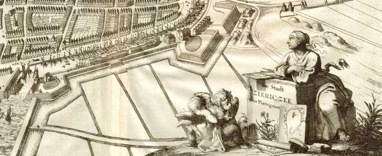
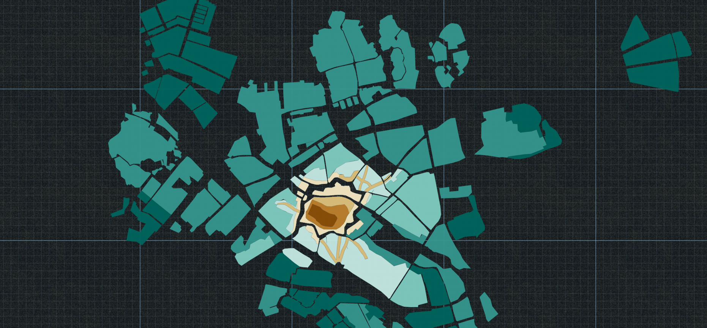
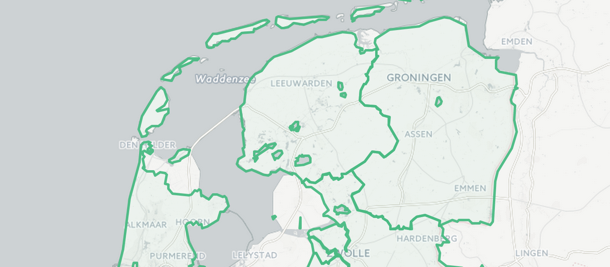
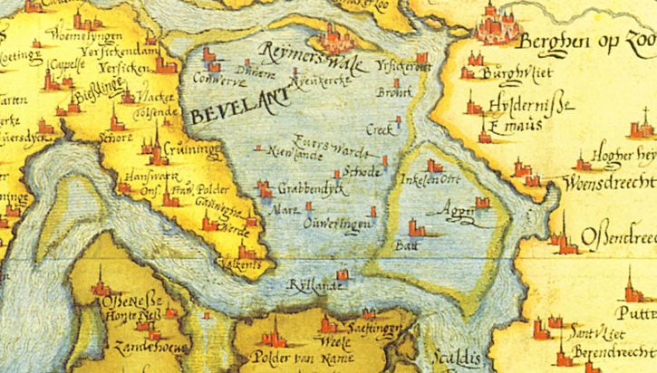
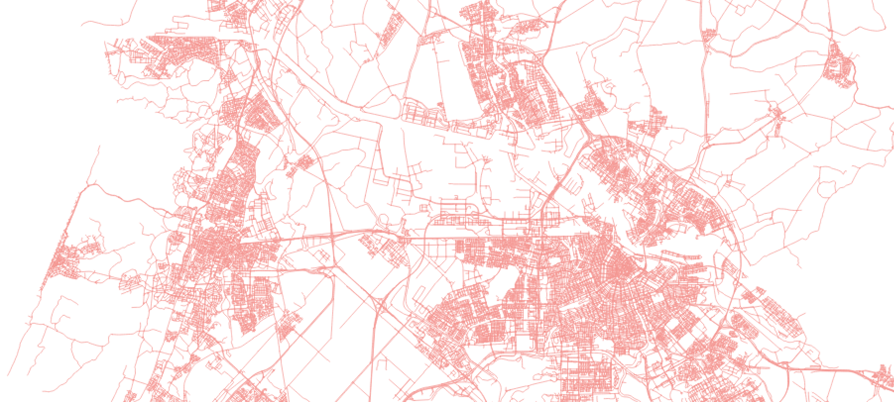

#ErfGeo 

##tagline

> Nederlandse topografie door de tijd

Andere opties:

- Veranderingen in de Nederlandse Topografie
- Plaats en tijd - veranderingen in de Nederlandse topografie

##op Homepage

> ErfGeo toont de topografie van Nederland in de loop der tijd. Van Dorestad tot Lelystad, van Pieterskerk tot Nils Bohrweg 1, van Burgwal tot Bob Marleystraat, van Noviomagus tot Nijmegen en van Oude Niedorp tot Hollands Kroon. 
> 
> Deze website ontsluit plaatsen, bestuurlijke eenheden, straten, adressen en zelfs gebouwen die ooit in Nederland hebben bestaan.

#Wat voor data vind je in ErfGeo? Tien voorbeelden

##1) Sircxsee en andere toponiemen

In oude bronnen kom je soms plaatsnamen tegen waar je als mens toch even over na moet denken. Cuelborch, dat zal Culemborch zijn. Gaude is Gouda, Haghe Den Haag, Swol Zwolle en Sircxsee, dat is [Zierikzee](http://geothesaurus.nl/hgconcept/tgn/7030107). Voor een computer wordt dat al erg lastig. En dat Weerdt op Valkenswaard slaat, Traiecto op Maastricht, Vorcum op Woudrichem en Buscoducis op Den Bosch, dat is voor zowel mens als machine zonder achterliggende kennis lastig te doorzien.

Dankzij datasets als de rekeningen van de Illustre Lieve Vrouwe Broederschap, Militieregisters en het herkomstonderzoek van Simon Hart kent ErfGeo tienduizenden plaatsnaamvarianten. Alleen voor Zierikzee zijn het er al bijna twintig. Omdat we uit veel bronnen ook de periode kunnen halen waarin een naamvariant gebruikt werd, kan je mooi zien [wanneer](http://www.islandsofmeaning.nl/projects/names-in-time/?uri=http://vocab.getty.edu/tgn/7030107) welke variant in zwang was.

##2) De groei van Zwolle tussen 1200 en 2010

De Atlas van de verstedelijking in Nederland toont van de 35 grootste steden van het land hoe zij in de loop der eeuwen expandeerden. De voor het boek gemaakte geometrieën zijn opgenomen in ErfGeo.

Van [Zwolle](http://geothesaurus.nl/hgconcept/tgn/7007077) zijn bijvoorbeeld geometrieën uit 1200, 1350, 1500, 1650, 1900, 1950, 1980 en 2010 beschikbaar.

##3) Departementen uit de Franse Tijd

In de Franse tijd is ook Nederland kortstondig ingedeeld in departementen. Bij een nieuwe indeling in 1811 werden de departementen vooral vernoemd naar waterlopen: Monden van de Rijn, Monden van de Schelde, Westereems, Zuiderzee, Boven-IJssel, etc. Alleen Friesland hield haar oude naam.

Behalve de ligging der departementen laten [de geometrieën](http://histograph.io/viewer/#search=* type=hg:Departement) ook mooi de toenmalige kustlijn zien. Zo zie je in de kop van departement Zuiderzeé het eiland Wieringen nog liggen.

##4) Overstroming, overstuiving, ontvolking en oorlog

In de loop der eeuwen zijn veel dorpen en zelfs steden verdwenen. Veelal door overstromingen, maar ook zandverstuivingen, oorlogsgeweld, ontvolking en de vooruitgang eisten hun tol.

Bijna 600 verdwenen dorpen zijn door Bert Stulp ten boek gesteld, en deze plaatsen zijn ook terug te vinden in ErfGeo.

##5) Van Abcoude naar De Ronde Venen - twee eeuwen gemeentelijke herindelingen

Een purist spreekt niet van de gemeente Abcoude, want onduidelijk is dan of het over de gemeente Abcoude gaat die bestond tot 1818 of de gemeente Abcoude die bestond tussen 1941 en 2011. In de tussenliggende periode bestonden twee gemeentes met Abcoude in de naam: Abcoude-Proostdij en Abcoude-Baambrugge. In 2011 is Abcoude opgegaan in Ronde Venen.

Van het tweede Abcoude is bovendien de grens nog een paar keer gewijzigd. Niet alleen al deze gemeentes, maar ook die veranderende grenzen, zijn te vinden in ErfGeo.

##6) Huidig Nederland: plaatsen

Uit verschillende bronnen hebben we Nederlandse plaatsen opgenomen. Belangrijkste leveranciers: Getty's TGN en GeoNames. Het zijn er zo'n zevenduizend. Deze bronnen gebruiken we als basis waar het gaat om plaatsen: plaatsnaamvarianten uit historische bronnen kunnen we zo met de huidige plaats verbinden.

##7) Huidig Nederland: straten

Het Nationaal Wegenbestand, dat alle straten van Nederland bevat, is in ErfGeo opgenomen. Het feit dat het NWB van elke straat de geometrie bevat maakt dit bestand het startpunt voor iedereen die iets met straten wil.

Ook hier geldt dat we zo een basis hebben waaraan we historische straatnamen kunnen verbinden.

##8) Huidig Nederland: gebouwen en adressen

De BAG (Basis Administratie Gebouwen en Adressen) bevat, zoals de naam al zegt, alle gebouwen en alle adressen van Nederland. Adressen zijn aangegeven met een puntlocatie, van elk gebouw is een polygoon beschikbaar.

Aardig is dat de BAG niet alleen gegevens over de huidige stand van zaken bevat. Van elk pand is een bouwperiode opgenomen. Dit is verre van precies, en die precisie gaat bij bouwwerken van voor pakweg 1800 helemaal verloren, maar vanwege de landelijke dekking kan dit toch inzicht geven in de historie.

##9) Buitenland

We richten ons op Nederland, maar de Nederlandse geschiedenis houdt natuurlijk niet op bij de grens. Immers, onze geschiedenis is deels ook koloniaal, de grenzen liepen wel eens anders, het Nederlands taalgebied loopt tot in Frankrijk en de immigratie naar onze zeventiende-eeuwse steden was massaal.

##10) Carnaval!

schimpnamen, meertens en kloeke

_____________

#De factor tijd toevoegen aan ErfGeo - tien voorbeelden
